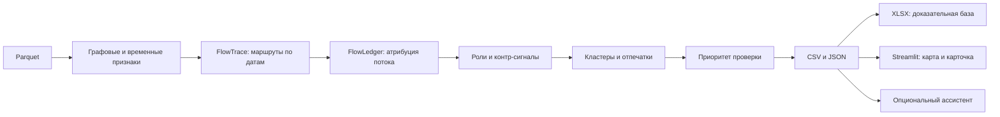

# Граф денег — рабочее место AML-аналитика

Инструмент восстанавливает финансовую структуру наблюдаемой сети переводов, объясняет роли и формирует очередь проверки.
Структурные связи сопоставляются с хронологически возможными маршрутами и атрибутированным потоком от seed.
**Выводы — гипотезы, не установление вины.**


## 1. Что реализовано

Локальный пайплайн рассчитывает роли всех узлов, хронологические маршруты, атрибуцию потока, кластеры и объяснимую очередь проверки. Интерфейс позволяет найти любой gid, проверить его соседей, критерии роли и контр-сигналы, сравнить слои сети и скачать основания в XLSX. Все эти возможности работают без ключа API; ассистент подключается отдельно.

После аудита уточнены объяснения ролей, оформление и выбор узлов на карте, резервный денежный слой и полнота общей книги: она включает все 210 запросов из текущей выгрузки. Итоговая проверка этой доработки: см. [docs/AUDIT.md](docs/AUDIT.md). Состояние веток: [STATUS_A](docs/STATUS_A.md), [STATUS_B](docs/STATUS_B.md).
Ниже числовые таблицы относятся к сохранённой папке `out/`. Скриншоты сняты с реальной выгрузки; версия указана в [описании снимков](docs/screenshots/README.md).

<!-- RESULTS_START -->
<!-- VALUE:FINAL_RESULTS_FROM_A4 -->
Реальная выгрузка `out`: 2248 узлов, 3119 рёбер, 107 кластеров, топ-30. Время из `run_meta.json`: 33.5574 с. Пропущенные этапы: [].
<!-- ENDVALUE:FINAL_RESULTS_FROM_A4 -->
<!-- RESULTS_END -->

## 2. Быстрый старт

Рекомендуется **Python 3.12**; текущая проверенная версия — **3.12.14**. Команды выполняются из корня клона. Рабочая папка команды в Windows: `C:\Git\hack-1d79395e-brogrammers`.

Создайте и активируйте окружение:

```bash
python -m venv .venv
source .venv/bin/activate
```

Windows PowerShell: вместо `source` выполните `.venv\Scripts\Activate.ps1`. Если активация недоступна, используйте `.venv\Scripts\python.exe` вместо `python`, а приложение запускайте через `.venv\Scripts\python.exe -m streamlit run app.py`.

Данные находятся в `data/`: `nodes.parquet`, `edges.parquet`, `transactions.parquet` из архива организаторов. Если файлов нет, распакуйте предоставленный архив так, чтобы эти пути существовали. Новые внешние данные не используются.

Для воспроизведения проверенного окружения Windows / Python 3.12 используйте зафиксированные версии:

```bash
python -m pip install -r requirements-lock.txt && python run.py --data data --out out
```

`requirements-lock.txt` содержит прямые и транзитивные зависимости фактически установленного окружения, проверенного через `pip check`. Платформенные зависимости имеют маркеры. Это снимок Windows / Python 3.12; отдельная чистая установка именно этого lock-файла ещё не проверялась. `requirements.txt` сохраняет минимальные ограничения проекта; для интерфейса нужен Streamlit ≥1.64.0.

Для macOS/Linux есть минимальные требования и [ограничения версий B](tools/constraints-py312.txt), снятые с его проверенного окружения Python 3.12.14:

```bash
python -m pip install -r requirements.txt -c tools/constraints-py312.txt && python run.py --data data --out out
```

Constraints ограничивают версии зависимостей, но сами не устанавливают лишние платформенные пакеты. B6 проверял установку из `requirements.txt` на macOS с Python 3.12.14 для релиза `v1.0`; текущий constraints-файл B также содержит версии его последующей проверки интерфейса. Это не заявление о новой чистой установке всей доработки на каждой ОС. Windows lock и macOS constraints — разные снимки окружений. В PowerShell до версии 7 выполните установку и расчёт двумя командами. Затем:

```bash
python -m streamlit run app.py
```

Откройте локальный адрес, который напечатает Streamlit. В [.streamlit/config.toml](.streamlit/config.toml) включён `server.headless=true`: первый запуск не запрашивает email и не открывает браузер автоматически. `browser.gatherUsageStats=false` отключает сбор статистики использования Streamlit. Ключ OpenAI для пайплайна и интерфейса не требуется.
Проверка обязательных выгрузок: `python -m graf.check out`.
**В рабочем процессе команды `out/` пересчитывает и коммитит только A.** B использует `out_stub/`, для отдельного интеграционного прогона — `out_local/`.

### Пример проверки для жюри

1. Выполните `python run.py --data data --out out`. Команда создаст три обязательных CSV, дополнительные выгрузки и `evidence.xlsx`.
2. Выполните `python -m graf.check out` и `python -m pytest -q`. Результаты итоговой проверки этой доработки приведены в [docs/AUDIT.md](docs/AUDIT.md).
3. Запустите `streamlit run app.py`. В «Топ-листе» откройте первый узел и проверьте роль, суммы, контр-сигналы и пути. На карте переключитесь на «Деньги курьеров», установите Δ=2 дня; во вкладке «Доказательства» скачайте XLSX.

Для разработки B:

```bash
python tools/make_stub_outputs.py --data data --out out_stub
GRAF_OUT=out_stub streamlit run app.py
```

В Windows задайте `$env:GRAF_OUT="out_stub"` перед запуском. В боковой панели можно выбрать `out`, `out_stub` или другую папку; исходные данные — папка либо ZIP с папкой `data/` внутри. Без `GRAF_OUT` используется `out/`, когда есть `nodes_roles.csv` и A1 отмечен готовым в статусе A; иначе `out_stub/`.
Заглушка помечена в интерфейсе и XLSX: реальные связи и суммы, демонстрационные роли/скоры/след денег.
После обновления ветки остановите Streamlit (`Ctrl+C`) и запустите снова. Кнопка «Обновить выгрузки» сбрасывает кэш файлов, но не заменяет перезапуск Python после изменения кода.

## 3. Схема решения

Основной стек: Python 3.12, pandas и pyarrow для табличных данных, NumPy/SciPy и NetworkX для расчётов графа, Streamlit 1.64.0 и Plotly для интерфейса, pyvis для ego-графа, openpyxl для XLSX. Опциональный ассистент использует OpenAI SDK и Responses API. Аналитический расчёт, просмотр и выгрузка работают локально без внешних сервисов.

Визуальный прототип интерфейса подготовлен в [Google Stitch](https://stitch.withgoogle.com/). Рабочий интерфейс адаптирован командой с помощью Codex под реальные данные, расчёты и сценарии проекта.



Исходники схемы: [docs/scheme.mmd](docs/scheme.mmd). Пайплайн работает локально; алгоритмы используют фиксированный seed и явные пороги. Для воспроизведения сохраняйте исходные данные, конфигурацию и версии зависимостей. Время выполнения и служебные метаданные файлов могут различаться; LLM не назначает роли и не меняет результаты.

### Как получаются кластеры

Каждый узел входит ровно в один кластер. Сначала сеть разделяется на слабосвязные компоненты; внутри каждой Louvain работает на неориентированной проекции с весом связи, равным сумме переводов в обоих направлениях, и seed алгоритма 42. Изолированный узел остаётся отдельным кластером. Номера назначаются по убыванию размера, затем по минимальному gid; номер кластера не является оценкой риска.

В текущей выгрузке 107 кластеров, в 8 из них больше одного seed. Для каждого сохраняются размер, число seed, внутренний оборот, пять лидеров по приоритету, состав ролей и гипотеза. Направления и даты переводов сохраняются в исходном графе, маршрутах и карточках.

Отпечатки дополняют гипотезу признаками сбора, рассылки, цепочки транзита, распределения со сбором, структурного цикла и близости сумм к порогу выгрузки. В 58 кластерах правила отпечатков не сработали; отсутствие отпечатка не доказывает отсутствие значимых связей. Реализация: [graf/clusters.py](graf/clusters.py), [graf/fingerprints.py](graf/fingerprints.py).

## 4. Роли и объяснимость

Ворота и численные константы: [graf/config.py](graf/config.py), реализация: [graf/roles.py](graf/roles.py).
Сначала проверяются ворота; кандидат в организаторы имеет приоритет, затем payer, затем максимальный скор среди остальных доступных ролей. Это правило классификации, а не вероятность преступления.
`pt = out_kzt / in_kzt`; для seed этот показатель не применяется к воротам транзита/оседания и не служит основанием роли. Скоры ролей ограничены диапазоном 0–1; `pt` может превышать 1.

| Код | Подпись | Ворота | Скор |
|---|---|---|---|
| coordinator | кандидат в организаторы | `in_deg≥5` и `out_deg≥10`, либо `from_key≥3` и `to_key≥3` | `0.5 + 0.5 min(1,(from_key+to_key)/20)` |
| consolidator | признаки точки консолидации | ≥5 плательщиков | `0.4 min(1,in_deg/15)+0.2(1-in_hhi)+0.2 min(1,max_sync_payers/5)+0.2 min(1,2 tracked_share_in)` |
| distributor | признаки веерного распределения | ≥10 получателей | `0.5 min(1,out_deg/40)+0.3(1-out_hhi)+0.2 fast_out_share` |
| transit | признаки транзитного счёта | не seed, есть вход и выход, `0.8 ≤ pt ≤ 1.2` | `0.5 max(0,1-abs(1-pt)/0.2)+0.3 fast_out_share+0.2 [seed_exp_chrono>0]` |
| terminal | конечный получатель в пределах выгрузки | глубина ≤3, есть вход; нет выхода либо `pt<0.1` у не-seed | `0.7+0.3 tracked_share_in` |
| terminal (оценка E′) | оценка на обрыве наблюдения | глубина 4, `1-p_forward≥0.6`, более приоритетные ворота не дали роль | `1-p_forward`; отсутствие исходящих не подтверждает оседание |
| payer | разовый плательщик (возможный покупатель/потерпевший) | не seed, ≤2 получателей и ≤2 переводов, ≤100 000 ₸, получатель имеет ≥5 плательщиков; не транзит | `0.8` |
| peripheral | периферия, признаков роли не выявлено | другие ворота не пройдены | `0.5`; при обрыве `0.3` |

Ключевые узлы для `from_key`/`to_key` — объединение узлов, прошедших ворота консолидации, распределения или транзита; их итоговая роль может отличаться.

`payer` — документированное расширение словаря: разовый небольшой плательщик не должен автоматически попадать в очередь подозреваемых. `role_alt` хранит лучшую доступную альтернативу; `ambiguous=true` означает абсолютную разницу скоров <0.10. Из-за приоритета ворот coordinator его выбранный скор может быть ниже альтернативного. Уверенность по скору: низкая <0.5, средняя от 0.5 до <0.75, высокая ≥0.75; это не статистически калиброванная вероятность.
Скоры `payer=0.8`, обычной `peripheral=0.5` и `peripheral` при обрыве `0.3` заданы правилами, а не обучены на размеченных клиентах. Поэтому высокий скор payer означает соответствие поведению небольшого разового плательщика; его вес в приоритете остаётся низким. Данных с эталонными ролями нет, оценка accuracy не заявляется.

Пример evidence из сохранённой выгрузки:

<!-- VALUE:EVIDENCE_EXAMPLE_FROM_A4 -->
кандидат в организаторы (0.80): связей вход/выход 15/17 (порог 5/10); ключевых соседей 10→2. Контр: не выявлен
<!-- ENDVALUE:EVIDENCE_EXAMPLE_FROM_A4 -->

## 5. Приоритет проверки

По плану и `graf.config`: `priority = (0.30 role + 0.30 money + 0.20 brokerage + 0.10 volume + 0.10 temporal) × multiplier`.
Компоненты публикуются как `prio_role`, `prio_money`, `prio_brokerage`, `prio_volume`, `prio_temporal`; итоговый множитель — `prio_multiplier`. По [graf/priority.py](graf/priority.py): money — среднее процентильных рангов tracked_in и seed_exp_chrono; volume — процентиль log1p(in_kzt+out_kzt); temporal — максимум fast_out_share и индикатора ≥3 синхронных плательщиков. Brokerage — доля потери seed-достижимости при удалении узла, включая сам удалённый узел; без одновременно входящих и исходящих связей компонент равен нулю.
Веса ролей: кандидат в организаторы 1.0, консолидация 0.8, распределение 0.7, транзит 0.5, оседание 0.3, периферия 0.1, payer 0.05.
Множители из конфигурации: нет хронологической связи у не-seed 0.5; внешнее финансирование 0.7; seed 0.6, seed выше нижнего уровня 0.8; payer 0.2; исключённый счёт 0.0. Все применимые множители перемножаются ядром. Интерфейс показывает готовый итог и не пересчитывает его.

Вес brokerage равен 0,20, но его вклад — вес, умноженный на наблюдаемую потерю достижимости. Компонент не нормируется по процентилю. В текущем топ-30 его значения лежат от 0 до 0,01246, то есть максимальный вклад до множителей — около 0,00249. Малый фактический вклад соответствует формуле; веса не гарантируют одинаковое влияние признаков на этих данных.

Крупные распределители могут находиться ниже из-за слабого наблюдаемого следа seed и понижающих множителей. Среди узлов с ≥60 получателями лучший текущий ранг — 50. Очередь проверки не оптимизирует набор блокировок; при необходимости искать инфраструктурные точки разрушения графа надо отдельно сравнивать сценарии устойчивости.

## 6. Ловушки данных и AML

- Глубина 4 и нулевой выход означают обрыв обхода. `p_forward` оценивается калибровкой по более ранним коленам; это оценка неполной наблюдаемости.
- Входящие seed неполны. Большой `pass_through` не доказывает транзит или криминальный источник.
- Порог исходной выборки — 5 000 ₸; меньшие операции и другие банки не наблюдаются. Интервал 5 000–7 000 ₸ используется как признак близости к границе выгрузки. Это не установленный порог банковского контроля и не доказательство дробления.
- Есть только даты. Порядок операций внутри дня неизвестен; вычислительная сортировка по глубине/gid не устанавливает фактическую последовательность.
- Флаг `external_funding` ставится не-seed узлу при одновременных условиях `out_kzt/in_kzt > 2` и `tracked_out_share < 0.10`. Это контр-сигнал неполного источника средств, а не установленное происхождение денег. Само превышение исходящих над входящими недостаточно для флага; отсутствие флага не подтверждает полный баланс. В `visibility` для depth=4 приоритет имеет `out_unseen`, для seed — `in_unseen_seed`.
- Разовые плательщики могут быть покупателями или потерпевшими; payer и excluded исключаются из топа.
- Тип счёта неизвестен. Технические/агрегаторные счета исключаются по [config/excluded_accounts.csv](config/excluded_accounts.csv), который банк заполняет из АБС. `aggregator_like` — только повод запросить тип счёта.
- Всегда «кандидат в организаторы», а не утверждение виновности.

Аудит топ-10/топ-30 и калибровка:

<!-- VALUE:AUDIT_AND_TRUNCATION_FROM_A4 -->
Аудит (`audit.csv`):

| scope | check | count | ok |
| --- | --- | --- | --- |
| top10 | is_seed | 0 | True |
| top10 | payer | 0 | True |
| top10 | excluded | 0 | True |
| top10 | aggregator_like | 0 | True |
| top10 | visibility != full | 0 | True |
| top10 | seed_exp_chrono == 0 (non-seed) | 0 | True |
| top30 | is_seed | 0 | True |
| top30 | payer | 0 | True |
| top30 | excluded | 0 | True |
| top30 | aggregator_like | 0 | True |
| top30 | visibility != full | 0 | True |
| top30 | seed_exp_chrono == 0 (non-seed) | 0 | True |

Калибровка (`truncation_calibration.csv`):

| bucket | n | p_forward |
| --- | --- | --- |
| 1 | 1126 | 0.261101243339254 |
| 2-3 | 376 | 0.4813829787234042 |
| 4-10 | 183 | 0.7377049180327869 |
| >10 | 38 | 0.8947368421052632 |
<!-- ENDVALUE:AUDIT_AND_TRUNCATION_FROM_A4 -->

## 7. Структура ≠ деньги

`seed_exp_topo` — достижимость по рёбрам; `seed_exp_chrono` — по неубывающим датам, `seed_exp_fast` — с паузой ≤2 дней. Ни один из них не равен доле денег.
FlowLedger ограничивает пересылку атрибутированного потока доступными средствами. Атрибуция не доказывает, что именно те же денежные единицы прошли по маршруту.
В карте «Деньги курьеров» остаются достижимые узлы и seed; линии между ними — наблюдаемые структурные связи. Счётчик исключает seed из числителя и знаменателя.
В текущей версии `graf.flow.chrono_reach` готов: ползунок Δ от 1 до 31 дня запускает кэшируемый пересчёт. Без исходных транзакций или готового модуля пересчёта интерфейс использует сохранённые колонки для 2 и 31 дней; промежуточные Δ требуют транзакций.
Абляция и оседание по глубине:

<!-- VALUE:ABLATION_AND_TRACKED_FROM_A4 -->
Абляция (`ablation_links.csv`):

| level | n_nonseed_nodes | share |
| --- | --- | --- |
| topology | 2167 | 1.0 |
| chrono_any | 1346 | 0.6211352099676973 |
| chrono_7d | 974 | 0.4494693124134749 |
| chrono_2d | 702 | 0.3239501615136133 |

Атрибутированное оседание, ₸ (`tracked_by_depth.csv`):

| depth | tracked_kept_kzt |
| --- | --- |
| 0 | 0.0 |
| 1 | 38993344.11 |
| 2 | 6886042.29 |
| 3 | 910686.0 |
| 4 | 109319.0 |
<!-- ENDVALUE:ABLATION_AND_TRACKED_FROM_A4 -->

## 8. Выгрузки и интерфейс

Полный точный контракт типов и колонок: [TEAM_PLAN §4](docs/TEAM_PLAN.md#4-контракт-между-a-и-b-не-менять-без-договорённости).

| Файл | Основные поля / назначение |
|---|---|
| nodes_roles.csv | первые: `gid,role,role_score,cluster_id,priority_score,evidence`; далее признаки, флаги, денежный след и компоненты приоритета |
| clusters.csv | `cluster_id,n_nodes,n_seed,sum_kzt_internal,top_gids,hypothesis`; отпечатки и состав ролей |
| top_nodes.csv | `rank,gid,role,priority_score,why`; очередь проверки без payer/excluded |
| seeds_review.csv | `gid,role,role_label,evidence` для пересмотра уровня seed |
| paths.csv | `target_gid,path_rank,seed_gid,hops,path_gids,path_days,path_amounts,bottleneck_kzt` |
| resilience.csv | `strategy,n_removed,seed_reach_share,largest_wcc,n_trials,seed_reach_p05,seed_reach_p95` |
| ablation_links.csv | `level,n_nonseed_nodes,share` |
| tracked_by_depth.csv | `depth,tracked_kept_kzt` |
| truncation_calibration.csv | `bucket,n,p_forward` |
| data_requests.csv | `gid,request,reason,priority_score` |
| audit.csv | `scope,check,count,ok` |
| graph.json | узлы/направленные рёбра, сохранённая раскладка, метаданные |
| run_meta.json | времена, параметры, число строк, пропущенные этапы |
| evidence.xlsx | шесть листов ниже |

Листы XLSX: **Сводка**, **Признаки** (включая пороги), **Транзакции-основания**, **Пути денег** (по шагам), **Критерии**, **Границы данных** (включая запросы).
Общая книга строится по топ-30 для карточек и оснований переводов; её лист «Границы данных» включает все строки `data_requests.csv` — 210 в текущих данных. Полнота проверена целевыми тестами: 81 запрос входящих seed, 99 запросов переводов ниже порога и 30 запросов времени транзакций. Книга выбранного узла включает только запросы его gid.
Основания переводов: сбор, синхронный сбор, пересылка ≤2 дней, маршрут от seed, веерная рассылка либо контекст. Это проверяемые признаки, а не доказательство вины. Вкладка «Доказательства» показывает предпросмотр и выгружает всю базу или выбранный узел.

CSV предназначены для программной обработки и сохранены в UTF-8; gid содержит 18 цифр и читается как int64. В JSON, браузере, Plotly, pyvis и XLSX он передаётся строкой. Для просмотра в Excel используйте `evidence.xlsx`, где задан текстовый формат `@`. При импорте CSV через «Данные → Из текста/CSV» выберите UTF-8 и тип «Текст» для gid/src/dst до загрузки: автоматическое открытие может округлить идентификатор. Не преобразуйте gid в float.
Поиск по полному gid/префиксу и выбор строки топа открывают карточку. Клик по точке карты сразу выделяет узел и соседей, после чего доступна кнопка карточки. Сводка и главный контр-сигнал находятся над ego-графом. В подписях соседей gid сокращён до уникального окончания; полный номер доступен при наведении и остаётся идентификатором узла. Ego-граф ограничен ближайшими 250 узлами; общая карта рисует до 400 крупнейших рёбер, стрелки у 100. Ограничение отображения не меняет признаки карточки.
Недостающие дополнительные выгрузки явно отмечаются. Отсутствие подготовленного пути не означает отсутствие маршрута.

## 9. Устойчивость сети

Сравнивается удаление не-seed узлов по priority, betweenness, out_deg, in_deg и random; отдельно — всех seed. Оси: число удалённых узлов и доля исходно достижимых не-seed, которые остаются достижимыми от сохранившихся seed. Дополнительная метрика — размер крупнейшей слабосвязной компоненты.

`random` — среднее **100** воспроизводимых случайных порядков удаления (`RANDOM_TRIALS=100`, seed генератора 42). Внутри каждого испытания разные N используют префиксы одного порядка. `seed_reach_p05` и `seed_reach_p95` — эмпирические 5-й и 95-й процентили исходов с линейной интерполяцией, **не доверительный интервал среднего**. В строках random `largest_wcc` также является средним и может быть дробным. Для детерминированных стратегий `n_trials=1`, обе границы равны результату, размер компоненты целочисленный.
Это структурный сценарий, не прогноз поведения участников. Приоритет аналитической проверки объединяет роль, атрибутированные деньги, связность, объём и временные признаки. Он не оптимизирует только разрушение графа: стратегия out_deg может сильнее снижать достижимость при удалении того же числа узлов. Это различие целей учитывается при сравнении кривых.
Результат сохранённого расчёта:

<!-- VALUE:RESILIENCE_FROM_A4 -->
Последняя точка каждой стратегии (`resilience.csv`):

| strategy | n_removed | seed_reach_share | largest_wcc | n_trials | seed_reach_p05 | seed_reach_p95 |
| --- | --- | --- | --- | --- | --- | --- |
| priority | 50 | 0.8500230733733272 | 1574.0 | 1 | 0.8500230733733272 | 0.8500230733733272 |
| betweenness | 50 | 0.6229810798338717 | 1240.0 | 1 | 0.6229810798338717 | 0.6229810798338717 |
| out_deg | 50 | 0.4919243193354868 | 1045.0 | 1 | 0.4919243193354868 | 0.4919243193354868 |
| in_deg | 50 | 0.7508075680664513 | 1396.0 | 1 | 0.7508075680664513 | 0.7508075680664513 |
| random | 50 | 0.9541347485002306 | 1795.64 | 100 | 0.9149053991693584 | 0.9700276880479928 |
| all_seeds | 81 | 0.0 | 1524.0 | 1 | 0.0 | 0.0 |
<!-- ENDVALUE:RESILIENCE_FROM_A4 -->

## 10. Опциональный ИИ-ассистент

В локальном `.env` задайте `OPENAI_API_KEY` и `OPENAI_MODEL` (доступную вашему аккаунту модель с Responses tool calling). Ключ не коммитится. При включении выбранные сведения графа и вопрос отправляются API OpenAI; используйте его только в разрешённом для этих данных окружении.
Без ключа приложение полностью работает; вкладка показывает инструкцию. Модель не участвует в основном расчёте.
Инструменты: `node_card`, `neighbors`, `money_trail`, `common_receivers` (≤2 шага), `top_nodes`, `cluster_info`. Все только читают выгрузки; лимиты выдачи указаны в JSON.
Первый вызов обязательно получает данные инструментом. На каждом шаге повторяется системная инструкция: только факты из инструментов, осторожные гипотезы, контр-сигналы. Неизвестный 18-значный gid в ответе отмечается «⚠ непроверенная ссылка»; это проверка идентификаторов, не доказательство правильности всего текста. Демонстрационные данные помечаются.

### Опциональные возможности из ТЗ §8

| Возможность | Что реализовано | Граница реализации |
|---|---|---|
| Учёт обрыва обхода | visibility, калибровка p_forward, оценка terminal на depth=4, предупреждения | Реальные операции за границей наблюдения неизвестны |
| Временные паттерны | Пересылка в течение 0–2 дней, синхронные плательщики, маршруты с неубывающими датами | Время внутри дня отсутствует |
| Маршруты и возвратные потоки | До 3 объясняющих путей к каждому узлу топ-30; структурные циклы длиной до 6 | Повторяемость одного маршрута отдельно не оценивается; даты циклов не проверяются |
| Аномалии | Доля переводов в интервале 5 000–7 000 ₸, концентрация плательщиков, признаки внешнего финансирования | Нет отдельной модели выбросов относительно колена; близость к порогу выгрузки не доказывает дробление |
| Устойчивость | Четыре детерминированных порядка, среднее и процентили 100 случайных испытаний, удаление всех seed | Структурный эксперимент не прогнозирует поведение клиентов |
| AI-ассистент | Вопросы по инструментам, ссылки на проверенные gid, контр-сигналы | Проверен моками; успешный живой платный API-вызов не заявлен |
| Карточка узла | Локальная сводка с ролью, числами, потоками, соседями, критериями и запросами; опциональная AI-справка | Локальная карточка работает без API |
| Полнота данных | visibility, ограничения выгрузки и правила следующих запросов | Список запросов эвристический и не покрывает все отсутствующие банковские сведения |

Правило запроса исходящих на границе требует `depth=4`, `p_forward≥0.5` и `rank≤200`; в текущих данных оно не выбрало ни одного узла. Отсутствие такой строки запроса не означает, что исходящие известны: предупреждение об обрыве сохраняется в карточке. На этих данных также не обнаружены отпечатки chain и scatter_gather; это результат заданных правил и наблюдаемой сети.

## 11. Ограничения и воспроизводимость

Доступен только ограниченный срез внутрибанковских переводов за июль 2026 с глубиной обхода 4. Нет полных балансов, операций других банков, личности клиента и типа счёта. Нельзя восстанавливать эти атрибуты догадками.
Louvain выполняется на неориентированной проекции; пути и показанные переводы направлены. Изолированные seed сохраняются в выгрузках.
Пороги эвристические; роли и приоритеты требуют проверки аналитиком. Публичная развёрнутая версия не опубликована, приложение запускается локально. Дисклеймер на каждой странице: «Инструмент приоритизации проверки. Выводы — гипотезы, не установление вины».

```bash
python tools/make_stub_outputs.py --data data --out out_stub
python -m pip check
python -m pytest -q
python tools/smoke_ui.py
```

Тесты проверяют точность gid, направления, даты путей, поиск и навигацию, вкладки без ключа, полноту XLSX, Responses API на моке и случайные сценарии устойчивости. `smoke_ui.py` поднимает отдельный сервер на свободном localhost-порту на 15 секунд и завершает его. Итоговая проверка этой доработки: см. [docs/AUDIT.md](docs/AUDIT.md).

Краткая история: `v1.0` (`d71c067`) объединил A0–A6 и B0–B5. По отчёту [B-002](forA.md), B6 проверил отдельный клон этого SHA и новый venv: 49 тестов, выгрузки, XLSX, интерфейс и расчёт за 27,2789 с. Ограничения получения клона через GitHub API описаны там же. Это историческая проверка указанного релиза, а не итог более поздних изменений.

## 12. Масштабирование до ~1 млн узлов

Для больших выборок: Parquet + Polars/DuckDB для агрегаций, igraph/graph-tool для графовых операций, Leiden для сообществ, приближённая betweenness вместо точной. FlowTrace — индекс `(src,date)` и ограниченный top-K фронтир с явной оценкой потерь полноты. Интерфейс показывает карту кластеров и ego-граф, а не миллион точек. Это план развития, не заявление о проверенной производительности текущей версии.

## 13. Команда и Codex

A — аналитическое ядро, тесты ядра и `out/`; B — интерфейс, XLSX, ассистент и документация. Владение файлами: [AGENTS.md](AGENTS.md); общий план: [TEAM_PLAN](docs/TEAM_PLAN.md).
Промты: [участник A](docs/codex_prompts_A.md), [участник B](docs/codex_prompts_B.md). Коммиты задач отмечены `[codex]`. B работает в `b-ui` и получает `a-core`; финальную сборку в main публикует A.
Подготовленный [пятиминутный сценарий](docs/DEMO.md) включает лидера очереди, консолидацию и узел на границе наблюдения. Дополнительные карточки — в [docs/node_review.md](docs/node_review.md): топ-1 `100000008165763100` — сочетание ролей и неоднозначность; `100000003115284100` — консолидация с высокой долей атрибутированного входа; `100000004156082100` — кандидат в организаторы с внешним финансированием. Идентификаторы взяты из обзора A5 и вводятся в поиск, в коде они не зашиты.

После нового пересчёта `out/` обновите числовые таблицы командой `python tools/update_readme_results.py --out out`. Она читает выгрузки и меняет только README.
