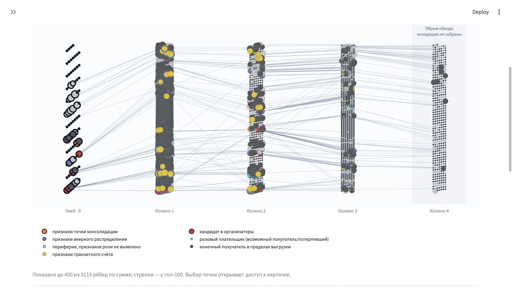
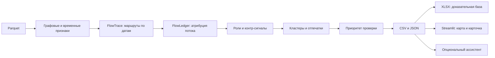

# Граф денег — рабочее место AML-аналитика

Инструмент восстанавливает финансовую структуру наблюдаемой сети переводов, объясняет роли и формирует очередь проверки.
Структурные связи сопоставляются с хронологически возможными маршрутами и атрибутированным потоком от seed.
**Выводы — гипотезы, не установление вины.**



## 1. Состояние поставки

B0–B4 проверены на заглушке и реальных выгрузках A. Актуальный этап ядра — [STATUS_A](docs/STATUS_A.md), статус интерфейса — [STATUS_B](docs/STATUS_B.md).
Получены реальные результаты A4/A5 и пересчёт A6 (`a-core`, `557a13c`). Финальная проверка чистого main остаётся задачей B6 после сообщения A.
Скриншоты сняты с реальной папки `out/`; версия ядра указана в [описании снимков](docs/screenshots/README.md).

<!-- RESULTS_START -->
<!-- VALUE:FINAL_RESULTS_FROM_A4 -->
Реальная выгрузка `out`: 2248 узлов, 3119 рёбер, 107 кластеров, топ-30. Время из `run_meta.json`: 24.5639 с. Пропущенные этапы: [].
<!-- ENDVALUE:FINAL_RESULTS_FROM_A4 -->
<!-- RESULTS_END -->

## 2. Быстрый старт

Нужен Python **3.11 или 3.12**. Из корня репозитория создайте окружение:

```bash
python -m venv .venv
source .venv/bin/activate
```

Windows PowerShell: `.venv\Scripts\Activate.ps1`.
Данные находятся в `data/`: `nodes.parquet`, `edges.parquet`, `transactions.parquet` из архива организаторов. Если файлов нет, распакуйте предоставленный архив так, чтобы эти пути существовали. Новые внешние данные не используются.

Одна команда установки и полного пересчёта:

```bash
pip install -r requirements.txt && python run.py --data data --out out
```

В PowerShell до версии 7 выполните две команды отдельно. Затем:

```bash
streamlit run app.py
```

Откройте локальный адрес, который напечатает Streamlit. Ключ OpenAI для пайплайна и интерфейса не требуется.
Проверка обязательных выгрузок: `python -m graf.check out`.
**В рабочем процессе команды `out/` пересчитывает и коммитит только A.** B использует `out_stub/`, для отдельного интеграционного прогона — `out_local/`.

Для разработки B:

```bash
python tools/make_stub_outputs.py --data data --out out_stub
GRAF_OUT=out_stub streamlit run app.py
```

В Windows задайте `$env:GRAF_OUT="out_stub"` перед запуском. В боковой панели можно выбрать `out`, `out_stub` или другую папку; исходные данные — папка либо ZIP с папкой `data/` внутри. Без `GRAF_OUT` используется `out/`, когда есть `nodes_roles.csv` и A1 отмечен готовым в статусе A; иначе `out_stub/`.
Заглушка помечена в интерфейсе и XLSX: реальные связи и суммы, демонстрационные роли/скоры/след денег.
После обновления ветки остановите Streamlit (`Ctrl+C`) и запустите снова. Кнопка «Обновить выгрузки» сбрасывает кэш файлов, но не заменяет перезапуск Python после изменения кода.

## 3. Схема решения



Исходники схемы: [docs/scheme.mmd](docs/scheme.mmd). Пайплайн локальный и детерминированный; LLM не назначает роли и не меняет результаты.

## 4. Роли и объяснимость

Ворота и численные константы: [graf/config.py](graf/config.py), реализация: [graf/roles.py](graf/roles.py).
Сначала проверяются ворота; кандидат в организаторы имеет приоритет, затем payer, затем максимальный скор среди остальных доступных ролей. Это правило классификации, а не вероятность преступления.
`pt = out_kzt / in_kzt`; для seed этот показатель не используется. Доли ограничены диапазоном 0–1.

| Код | Подпись | Ворота | Скор |
|---|---|---|---|
| coordinator | кандидат в организаторы | одновременно сбор и рассылка, либо ≥3 ключевых входящих и ≥3 ключевых исходящих | `0.5 + 0.5 min(1,(from_key+to_key)/20)` |
| consolidator | признаки точки консолидации | ≥5 плательщиков | `0.4 min(1,in_deg/15)+0.2(1-in_hhi)+0.2 min(1,max_sync_payers/5)+0.2 min(1,2 tracked_share_in)` |
| distributor | признаки веерного распределения | ≥10 получателей | `0.5 min(1,out_deg/40)+0.3(1-out_hhi)+0.2 fast_out_share` |
| transit | признаки транзитного счёта | не seed, есть вход и выход, `0.8 ≤ pt ≤ 1.2` | `0.5 max(0,1-abs(1-pt)/0.2)+0.3 fast_out_share+0.2 [seed_exp_chrono>0]` |
| terminal | конечный получатель в пределах выгрузки | глубина ≤3, есть вход; нет выхода либо `pt<0.1` у не-seed; на глубине 4 — оценка `1-p_forward≥0.6`, если нет других ролей | `0.7+0.3 tracked_share_in`; на границе `1-p_forward` |
| payer | разовый плательщик (возможный покупатель/потерпевший) | не seed, ≤2 получателей и ≤2 переводов, ≤100 000 ₸, получатель имеет ≥5 плательщиков; не транзит | `0.8` |
| peripheral | периферия, признаков роли не выявлено | другие ворота не пройдены | `0.5`; при обрыве `0.3` |

`payer` — документированное расширение словаря: разовый небольшой плательщик не должен автоматически попадать в очередь подозреваемых. Поле `role_alt` и `ambiguous` отмечают близкие оценки (разница <0.10). Уверенность по скору: низкая <0.5, средняя <0.75, высокая ≥0.75; это не статистически калиброванная вероятность.
Пример evidence из финальной выгрузки:

<!-- VALUE:EVIDENCE_EXAMPLE_FROM_A4 -->
кандидат в организаторы (0.80): входящих связей 15; исходящих связей 17. Контр: не выявлен
<!-- ENDVALUE:EVIDENCE_EXAMPLE_FROM_A4 -->

## 5. Приоритет проверки

По плану и `graf.config`: `priority = (0.30 role + 0.30 money + 0.20 brokerage + 0.10 volume + 0.10 temporal) × multiplier`.
Компоненты публикуются как `prio_role`, `prio_money`, `prio_brokerage`, `prio_volume`, `prio_temporal`; итоговый множитель — `prio_multiplier`. По [graf/priority.py](graf/priority.py): money — среднее процентильных рангов tracked_in и seed_exp_chrono; volume — процентиль log1p(in_kzt+out_kzt); temporal — максимум fast_out_share и индикатора ≥3 синхронных плательщиков. Brokerage — доля потери seed-достижимости при удалении узла, включая сам удалённый узел; без одновременно входящих и исходящих связей компонент равен нулю.
Веса ролей: кандидат в организаторы 1.0, консолидация 0.8, распределение 0.7, транзит 0.5, оседание 0.3, периферия 0.1, payer 0.05.
Множители из конфигурации: нет хронологической связи у не-seed 0.5; внешнее финансирование 0.7; seed 0.6, seed выше нижнего уровня 0.8; payer 0.2; исключённый счёт 0.0. Все применимые множители перемножаются ядром. Интерфейс показывает готовый итог и не пересчитывает его.

## 6. Ловушки данных и AML

- Глубина 4 и нулевой выход означают обрыв обхода. `p_forward` оценивается калибровкой по более ранним коленам; это оценка неполной наблюдаемости.
- Входящие seed неполны. Большой `pass_through` не доказывает транзит или криминальный источник.
- Порог исходной выборки — 5 000 ₸; меньшие операции и другие банки не наблюдаются.
- Есть только даты. Порядок операций внутри дня неизвестен; вычислительная сортировка по глубине/gid не устанавливает фактическую последовательность.
- Отправка существенно больше полученного указывает на внешнее финансирование и служит контр-сигналом.
- Разовые плательщики могут быть покупателями или потерпевшими; payer и excluded исключаются из топа.
- Тип счёта неизвестен. Технические/агрегаторные счета исключаются по [config/excluded_accounts.csv](config/excluded_accounts.csv), который банк заполняет из АБС. `aggregator_like` — только повод запросить тип счёта.
- Всегда «кандидат в организаторы», а не утверждение виновности.

Аудит топ-10/топ-30 и калибровка:

<!-- VALUE:AUDIT_AND_TRUNCATION_FROM_A4 -->
Аудит (`audit.csv`):

| scope | check | count | ok |
| --- | --- | --- | --- |
| top10 | is_seed | 0 | True |
| top10 | payer | 0 | True |
| top10 | excluded | 0 | True |
| top10 | aggregator_like | 0 | True |
| top10 | visibility != full | 0 | True |
| top10 | seed_exp_chrono == 0 (non-seed) | 0 | True |
| top30 | is_seed | 0 | True |
| top30 | payer | 0 | True |
| top30 | excluded | 0 | True |
| top30 | aggregator_like | 0 | True |
| top30 | visibility != full | 0 | True |
| top30 | seed_exp_chrono == 0 (non-seed) | 0 | True |

Калибровка (`truncation_calibration.csv`):

| bucket | n | p_forward |
| --- | --- | --- |
| 1 | 1126 | 0.261101243339254 |
| 2-3 | 376 | 0.4813829787234042 |
| 4-10 | 183 | 0.7377049180327869 |
| >10 | 38 | 0.8947368421052632 |
<!-- ENDVALUE:AUDIT_AND_TRUNCATION_FROM_A4 -->

## 7. Структура ≠ деньги

`seed_exp_topo` — достижимость по рёбрам; `seed_exp_chrono` — по неубывающим датам, `seed_exp_fast` — с паузой ≤2 дней. Ни один из них не равен доле денег.
FlowLedger ограничивает пересылку атрибутированного потока доступными средствами. Атрибуция не доказывает, что именно те же денежные единицы прошли по маршруту.
В карте «Деньги курьеров» остаются достижимые узлы и seed; линии между ними — наблюдаемые структурные связи. Счётчик исключает seed из числителя и знаменателя.
До отметки «graf.flow.chrono_reach … готов» в статусе A переключатель Δ использует готовые колонки для 2 и 31 дня; после подключения — кэшируемый пересчёт по Δ.
Абляция и оседание по глубине:

<!-- VALUE:ABLATION_AND_TRACKED_FROM_A4 -->
Абляция (`ablation_links.csv`):

| level | n_nonseed_nodes | share |
| --- | --- | --- |
| topology | 2167 | 1.0 |
| chrono_any | 1346 | 0.6211352099676973 |
| chrono_7d | 974 | 0.4494693124134749 |
| chrono_2d | 702 | 0.3239501615136133 |

Атрибутированное оседание, ₸ (`tracked_by_depth.csv`):

| depth | tracked_kept_kzt |
| --- | --- |
| 0 | 0.0 |
| 1 | 38993344.11 |
| 2 | 6886042.29 |
| 3 | 910686.0 |
| 4 | 109319.0 |
<!-- ENDVALUE:ABLATION_AND_TRACKED_FROM_A4 -->

## 8. Выгрузки и интерфейс

Полный точный контракт типов и колонок: [TEAM_PLAN §4](docs/TEAM_PLAN.md#4-контракт-между-a-и-b-не-менять-без-договорённости).

| Файл | Основные поля / назначение |
|---|---|
| nodes_roles.csv | первые: `gid,role,role_score,cluster_id,priority_score,evidence`; далее признаки, флаги, денежный след и компоненты приоритета |
| clusters.csv | `cluster_id,n_nodes,n_seed,sum_kzt_internal,top_gids,hypothesis`; отпечатки и состав ролей |
| top_nodes.csv | `rank,gid,role,priority_score,why`; очередь проверки без payer/excluded |
| seeds_review.csv | `gid,role,role_label,evidence` для пересмотра уровня seed |
| paths.csv | `target_gid,path_rank,seed_gid,hops,path_gids,path_days,path_amounts,bottleneck_kzt` |
| resilience.csv | `strategy,n_removed,seed_reach_share,largest_wcc` |
| ablation_links.csv | `level,n_nonseed_nodes,share` |
| tracked_by_depth.csv | `depth,tracked_kept_kzt` |
| truncation_calibration.csv | `bucket,n,p_forward` |
| data_requests.csv | `gid,request,reason,priority_score` |
| audit.csv | `scope,check,count,ok` |
| graph.json | узлы/направленные рёбра, сохранённая раскладка, метаданные |
| run_meta.json | времена, параметры, число строк, пропущенные этапы |
| evidence.xlsx | шесть листов ниже |

Листы XLSX: **Сводка**, **Признаки** (включая пороги), **Транзакции-основания**, **Пути денег** (по шагам), **Критерии**, **Границы данных** (включая запросы).
Основания переводов: сбор, синхронный сбор, пересылка ≤2 дней, маршрут от seed, веерная рассылка либо контекст. Это проверяемые признаки, а не доказательство вины. Вкладка «Доказательства» показывает предпросмотр и выгружает всю базу или выбранный узел.

gid — int64 при чтении CSV; в JSON, таблицах браузера, Plotly, pyvis и XLSX — строка. В Excel применяется текстовый формат `@`. Не преобразуйте идентификаторы в float.
Поиск по полному gid/префиксу, выбор строки топа и выбор точки на карте ведут к карточке. Ego-граф ограничен ближайшими 250 узлами; карта рисует до 400 крупнейших рёбер, стрелки у 100. Ограничение отображения не меняет признаки карточки.
Недостающие дополнительные выгрузки явно отмечаются. Отсутствие подготовленного пути не означает отсутствие маршрута.

## 9. Устойчивость сети

Сравнивается удаление узлов по priority, betweenness, out_deg, in_deg и random; отдельно — всех seed. Оси: число удалённых узлов и доля достижимости от seed, дополнительная метрика — крупнейшая слабосвязная компонента.
Это структурный сценарий, не прогноз поведения участников.
Результат финального расчёта:

<!-- VALUE:RESILIENCE_FROM_A4 -->
Последняя точка каждой стратегии (`resilience.csv`):

| strategy | n_removed | seed_reach_share | largest_wcc |
| --- | --- | --- | --- |
| random | 50 | 0.8569450853714813 | 1695 |
| betweenness | 50 | 0.6229810798338717 | 1240 |
| in_deg | 50 | 0.7508075680664513 | 1396 |
| priority | 50 | 0.8500230733733272 | 1574 |
| out_deg | 50 | 0.4919243193354868 | 1045 |
| all_seeds | 81 | 0.0 | 1524 |
<!-- ENDVALUE:RESILIENCE_FROM_A4 -->

## 10. Опциональный ИИ-ассистент

В локальном `.env` задайте `OPENAI_API_KEY` и `OPENAI_MODEL` (доступную вашему аккаунту модель с Responses tool calling). Ключ не коммитится. При включении выбранные сведения графа и вопрос отправляются API OpenAI; используйте его только в разрешённом для этих данных окружении.
Без ключа приложение полностью работает; вкладка показывает инструкцию. Модель не участвует в основном расчёте.
Инструменты: `node_card`, `neighbors`, `money_trail`, `common_receivers` (≤2 шага), `top_nodes`, `cluster_info`. Все только читают выгрузки; лимиты выдачи указаны в JSON.
Первый вызов обязательно получает данные инструментом. На каждом шаге повторяется системная инструкция: только факты из инструментов, осторожные гипотезы, контр-сигналы. Неизвестный 18-значный gid в ответе отмечается «⚠ непроверенная ссылка»; это проверка идентификаторов, не доказательство правильности всего текста. Демонстрационные данные помечаются.

## 11. Ограничения и воспроизводимость

Доступен только ограниченный срез внутрибанковских переводов за июль 2026 с глубиной обхода 4. Нет полных балансов, операций других банков, личности клиента и типа счёта. Нельзя восстанавливать эти атрибуты догадками.
Louvain выполняется на неориентированной проекции; пути и показанные переводы направлены. Изолированные seed сохраняются в выгрузках.
Пороги эвристические; роли и приоритеты требуют проверки аналитиком. Дисклеймер на каждой странице: «Инструмент приоритизации проверки. Выводы — гипотезы, не установление вины».

```bash
python tools/make_stub_outputs.py --data data --out out_stub
python -m pytest -q tests/test_ui_*.py tests/test_assistant_*.py
python tools/smoke_ui.py
```

Тесты проверяют точность gid, направления, даты путей, поиск/навигацию, вкладки без ключа, листы XLSX и Responses API на моке. `smoke_ui.py` поднимает отдельный сервер на свободном localhost-порту на 15 секунд и всегда завершает его. Проверку чистого клона main выполняет B6 только после отметки A «ФИНАЛ в main».

## 12. Масштабирование до ~1 млн узлов

Для больших выборок: Parquet + Polars/DuckDB для агрегаций, igraph/graph-tool для графовых операций, Leiden для сообществ, приближённая betweenness вместо точной. FlowTrace — индекс `(src,date)` и ограниченный top-K фронтир с явной оценкой потерь полноты. Интерфейс показывает карту кластеров и ego-граф, а не миллион точек. Это план развития, не заявление о проверенной производительности текущей версии.

## 13. Команда и Codex

A — аналитическое ядро, тесты ядра и `out/`; B — интерфейс, XLSX, ассистент и документация. Владение файлами: [AGENTS.md](AGENTS.md); общий план: [TEAM_PLAN](docs/TEAM_PLAN.md).
Промты: [участник A](docs/codex_prompts_A.md), [участник B](docs/codex_prompts_B.md). Коммиты задач отмечены `[codex]`. B работает в `b-ui` и получает `a-core`; финальную сборку в main публикует A.
Демо по [docs/node_review.md](docs/node_review.md): топ-1 `100000008165763100` — сочетание ролей и неоднозначность; `100000003115284100` — консолидация с высокой долей атрибутированного входа; `100000004156082100` — кандидат в организаторы с внешним финансированием. Идентификаторы взяты из обзора A5 и вводятся в поиск, в коде они не зашиты.

После получения готового A4 обновление чисел: `python tools/update_readme_results.py --out out`. Команда читает выгрузки и меняет только README.
